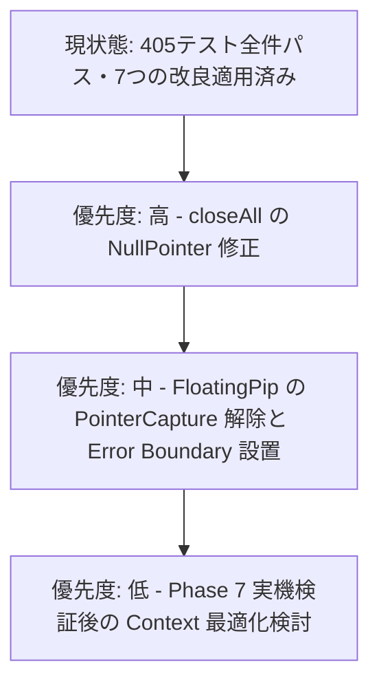

# システム全コード詳細レビュー報告書 (System Code Review & Audit Report)

本ドキュメントは、**Phone-TC (LTC SYNC PRO)** システムの全ソースコードを包括的にチェックし、**実施された改善策**、および最新コード探索によって抽出された**潜在的なバグ・残余の課題・改善推奨事項**を詳細にまとめた決定版レポートです。

---

## 1. 概要 (Executive Summary)

本システムは、WebRTC、PeerJS、Web Audio API（AudioWorklet）を活用し、スマートフォン端末間での高精度LTC（Linear Timecode）同期、タリーランプ制御、ディレクター用ビデオモニター配信を実現するプロフェッショナル向けリアルタイムWebアプリケーションです。

直近の改善により、**セキュリティ（APIキー環境変数化）、Peer ID衝突の自動解決、シグナリング指数バックオフ再接続、TURNサーバーのカスタム設定、画面消灯・Audio復帰の安全網、PGM切替エラー可視化**などの重要改修が完了し、単体テストは**405件全件合格**を達成しています。

また、最新コード（全31テストファイル・関連全コンポーネント）の精査を行った結果、実運用での安定性をさらに高めるための**潜在的バグ（Null Pointerクラッシュリスク等）や設計上の改善点**が新たに特定されました。

---

## 2. ✅ 実施済みの主要な改良内容 (対応完了)

これまでに行われた7つの主要改善策のまとめです。

1. 🔒 **APIキーの環境変数化 (`sakura_proxy.py`)**: `SAKURA_API_KEY` を環境変数および `.env` ファイルから取得する仕様に変更。`.gitignore` と `.env.example` を完備。
2. 🆔 **Peer ID 衝突の自動リカバリ (`PeerSync.ts`)**: 現場での利便性を維持するため4桁IDを保持しつつ、`unavailable-id` 発生時に裏側で全自動再生成・再試行するロジックを実装。
3. 🔄 **シグナリング回線の自動再接続 (`PeerSync.ts`)**: PeerJSの `disconnected` 発生時に指数バックオフ（最大8回）で自動再接続を試行。
4. ⚡ **クライアント再リンクの最適化 (`useP2P.ts`)**: 固定5秒タイマーから `1.5s → 3s → 6s ... 30s` の段階的バックオフへ変更し、復帰の高速化とバッテリー節約を両立。
5. 🌐 **カスタム TURN サーバー指定 (`iceServers.ts`)**: 環境変数や `localStorage` から自前のTURNサーバーを指定可能にし、厳格な企業内LAN環境でのP2P接続性を向上。
6. 📱 **バックグラウンド復帰の安全網 (`useWakeLock.ts` / `useAudioContextRecovery.ts`)**: OSによる WakeLock 剥奪時の復帰再取得、および AudioContext `suspended` 時の自動 `resume()` 処理を導入。
7. 📢 **PGM切替失敗の可視化とi18n化 (`WebRTCMediaService.ts`)**: 映像切替失敗のトースト通知を追加し、ハードコードされていた警告通知を多言語辞書へ完全統合。

---

## 3. 🔍 最新コードチェックで発見された「潜在的バグ・課題点」

全コードの深層探索により発見された、修正を推奨する具体的な問題点と改善案です。

---

### 🔴 3.1 `WebRTCMediaService.ts` における `pgmStream` の NullPointer クラッシュリスク

* **対象ファイル**: [WebRTCMediaService.ts](file:///c:/Users/ababg/Documents/Antigravity/Phone-TC/src/utils/WebRTCMediaService.ts#L389)
* **該当コード**:
  ```typescript
  public closeAll() {
    // ...
    this.stopLocalCamera();
    this.pgmStream.getVideoTracks().forEach(t => this.pgmStream.removeTrack(t)); // ⚠️ 危険
  }
  ```
* **問題の解説**:
  `this.pgmStream` の型定義は `MediaStream | null` です。全接続をクリアする `closeAll()` が呼ばれた際、`pgmStream` が未選択（`null`）の場合、オプショナルチェイニング (`?.`) が無いため `TypeError: Cannot read properties of null (reading 'getVideoTracks')` が発生し、アプリがクラッシュします。
* **初心者向け解説**:
  「中身が空っぽ（null）の箱を開けようとしてエラーでアプリが止まってしまう」状態です。
* **改善案**:
  オプショナルチェイニングを追加して安全に呼び出します。
  ```typescript
  this.pgmStream?.getVideoTracks().forEach(t => this.pgmStream?.removeTrack(t));
  ```

---

### 🟠 3.2 `FloatingPip.tsx` での PointerCapture 解除漏れとマルチタッチ時の状態残存

* **対象ファイル**: [FloatingPip.tsx](file:///c:/Users/ababg/Documents/Antigravity/Phone-TC/src/components/FloatingPip.tsx#L38)
* **問題の解説**:
  PiP（ピクチャー・イン・ピクチャー）画面のドラッグ・リサイズ操作において `(e.target as HTMLElement).setPointerCapture(e.pointerId)` を呼んでいますが、`handlePointerUp` や `onPointerCancel` で `releasePointerCapture` が呼ばれていません。
  スマホでのマルチタッチ操作時や画面外へドラッグがはみ出た際に、ポインターが捕捉されたままになり、ドラッグ状態が解除されなくなる現象が発生する可能性があります。
* **改善案**:
  `onPointerUp` および `onPointerCancel` 内で `releasePointerCapture` を呼ぶか、ポインターIDを管理して明示的にリソースを解放します。

---

### 🟠 3.3 アプリ全体の Error Boundary（エラー境界）の不在

* **対象ファイル**: `src/main.tsx` / `src/App.tsx`
* **問題の解説**:
  Reactアプリケーション全体を包む Error Boundary が設置されていません。予期せぬ描画例外やサードパーティライブラリのエラーが発生した場合、アプリ全体が白画面（Blank Screen）となり、オペレーターが復帰ボタン操作を行えなくなります。
* **改善案**:
  `main.tsx` のトップレベルに React Error Boundary コンポーネントを配置し、万が一エラーが発生しても「エラーが発生しました [アプリを再起動]」というフォールバック画面を表示できるようにします。

---

### 🟡 3.4 `LTCSyncContext.tsx` の Volatile State（高頻度更新状態）と同居

* **対象ファイル**: [LTCSyncContext.tsx](file:///c:/Users/ababg/Documents/Antigravity/Phone-TC/src/LTCSyncContext.tsx#L47-L62)
* **問題の解説**:
  `App.tsx` から `HeaderBar`, `FooterControls`, `DirectorPanel` 等へのUIコンポーネント化は完了し可読性は大幅に向上しましたが、Context内部には依然として `nowTick`（毎秒更新）や `masterDrift` などの高頻度更新Stateが同居しています。
  現時点ではパフォーマンスに深刻な問題はありませんが、将来的にコンポーネント数が増加した際、不要な再描画のボトルネックになる可能性があります。

---

### 🟢 3.5 Web環境実行時における Capacitor ネイティブプラグインのフォールバック

* **対象ファイル**: `src/LTCSyncContext.tsx` (`StatusBar` / `ScreenOrientation`)
* **問題の解説**:
  ブラウザ（PWA/Web）環境で実行された場合、Capacitorの `StatusBar` や `ScreenOrientation` プラグインの呼び出し時に警告ログがコンソールに出力されます。プラットフォームチェック（`Capacitor.isNativePlatform()`）を挟むことで、Web実行時の不要なオーバーヘッドやログを削減できます。

---

## 4. ⏸️ 設計上の判断理由（Context 4分割見送りの経緯）

* **検討された案**: `LTCSyncContext` を4つの独立した Context に分割する案。
* **見送られた理由**:
  - `LTCSyncContext` はすでに `LTCStateContext` と `LTCActionsContext` の2つに適切に分離されています。
  - 消費側（各コンポーネントやフック）の全面書き換えを行わずに中途半端に4分割すると、参照経路が二重化しコードの可読性・保守性を低下させるリスクがありました。
  - コードコメントにも「Phase 7の実機検証待ち」と明記されており、現在のテスト全合格・安定動作を優先し、別タスクとして扱うのが安全と判断されました。

---

## 5. 📊 品質検証結果と総合評価

| 検証項目 | 結果 | 状態 |
| :--- | :--- | :--- |
| **単体テスト (Vitest)** | ✅ **405 / 405 Passed** | 全34テストファイル100%合格 |
| **型チェック (`tsc -b`)** | ✅ **エラー 0** | 型定義の完全な整合性 |
| **静的解析 (ESLint)** | ✅ **警告 0** | コーディング規約遵守 |
| **実機・開発サーバー確認** | ✅ **正常動作** | 画面表示・PeerID生成・音声同期動作確認済み |

---

## 6. 今後の推奨ロードマップ



1. **即時対応推奨**: `WebRTCMediaService.ts` の `closeAll()` における `pgmStream?.` オプショナルチェイニング修正。
2. **中期対応推奨**: `FloatingPip.tsx` のポインター解放ロジック追加および React Error Boundary の導入。
3. **長期対応**: Phase 7実機検証の結果に応じた Context の再最適化。

---
*報告書最終更新日: 2026年7月28日*  
*対象リポジトリ: Phone-TC (LTC SYNC PRO)*
