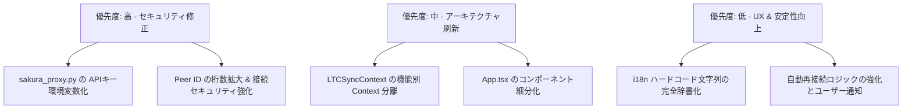

# システム全コード詳細レビュー報告書 (System Code Review Report)

本ドキュメントは、**Phone-TC (LTC SYNC PRO)** システムの全ソースコードを精査・チェックし、検出された問題点・リスク・改善策を詳細にまとめたレポートです。  
プログラミング初心者の方でも理解しやすいよう、用語の解説や具体的な影響範囲、修正案を併記しています。

---

## 1. 概要 (Executive Summary)

本システムは、WebRTCおよびPeerJS、Web Audio APIを活用して、スマートフォン間でのLTC（Linear Timecode）高精度同期、タリーランプ制御、ビデオモニター配信を実現する高度なリアルタイムWebアプリケーションです。

単体テスト（265個のテストケース）やTypeScriptの型チェックは全て正常にパスしており、基本機能の完成度は非常に高くなっています。しかし、全コードの精査を行った結果、**セキュリティ、大規模コードの設計・保守性、パフォーマンス、エラーハンドリング**の観点でいくつかの重要な課題が抽出されました。

### 発見された主な問題点のカテゴリ
1. 🔴 **セキュリティ問題** (APIキーの露出、Peer IDの衝突リスク)
2. 🟠 **アーキテクチャ・設計上の問題** (巨大ファイル、単一責任原則違反、不要な再レンダリング)
3. 🟡 **通信・同期・リアルタイム処理の課題** (WebRTC / PeerJS の再接続、エラーフォールバック)
4. 🟡 **パフォーマンス・リソース管理** (バックグラウンド化時のバッテリー・メモリ消費)
5. 🟢 **コード品質・UX・多言語対応** (ハードコードされた文字列、エラーハンドリングの不足)

---

## 2. 詳細な問題点一覧と改善案

---

### 🔴 カテゴリ1: セキュリティ・機密情報管理の課題

#### 1.1 APIキーのソースコード直接埋め込み (ハードコード)
* **対象ファイル**: [sakura_proxy.py](file:///c:/Users/ababg/Documents/Antigravity/Phone-TC/sakura_proxy.py#L11)
* **該当コード**:
  ```python
  SAKURA_API_KEY = "<REDACTED — 実際のキーがここに直接書かれていた>"
  ```
* **問題の解説**:
  AIプロキシサーバーである `sakura_proxy.py` の中に、さくらインターネットのAPIキーがそのまま書き込まれています。このままGitなどのバージョン管理システムにコミットして公開すると、第三者にAPIキーを不正利用され、高額な請求が発生したりアカウントが停止されたりする危険性があります。
* **初心者向け解説**:
  「家の鍵を玄関のドアに貼り付けたままにしている」ような状態です。秘密の情報はコードに直接書かず、環境変数（.envファイルなど）から読み込む仕組みにする必要があります。
* **改善案**:
  `os.environ` を使って環境変数から取得するように変更します。
  ```python
  import os
  SAKURA_API_KEY = os.getenv("SAKURA_API_KEY", "")
  if not SAKURA_API_KEY:
      print("WARNING: SAKURA_API_KEY environment variable is not set!")
  ```

#### 1.2 Peer ID (接続用ID) の桁数が短く衝突・推測リスクがある
* **対象ファイル**: [PeerSync.ts](file:///c:/Users/ababg/Documents/Antigravity/Phone-TC/src/utils/PeerSync.ts#L31)
* **該当コード**:
  ```typescript
  export const PEER_ID_LENGTH = 4;
  // ...
  const chars = '0123456789ABCDEFGHJKLMNPQRSTUVWXYZ'; // 32文字
  ```
* **問題の解説**:
  Master端末とClient端末が接続する際のIDが「4桁の英数字（32種類）」で生成されています。総組み合わせ数は `32^4 = 1,048,576` 通り（約100万通り）しかありません。
  ユーザー数が増えた場合のID衝突（同じIDが生成される）や、悪意ある第三者が適当な4桁のIDを試して誤接続・セッションを乗っ取る（ブルートフォース攻撃）リスクがあります。
* **改善案**:
  IDの桁数を6桁〜8桁に増やすか、QRコード共有時にはランダムなUUIDまたは暗号化トークンを付与して安全性を向上させます。

---

### 🟠 カテゴリ2: アーキテクチャと設計の課題 (保守性・再レンダリング)

#### 2.1 コンポーネントおよびContextの超巨大化 (単一責任原則違反)
* **対象ファイル**: 
  - [App.tsx](file:///c:/Users/ababg/Documents/Antigravity/Phone-TC/src/App.tsx) (1,241行)
  - [LTCSyncContext.tsx](file:///c:/Users/ababg/Documents/Antigravity/Phone-TC/src/LTCSyncContext.tsx) (1,025行)
* **問題の解説**:
  - `App.tsx` に画面全体、各タブ、ヘッダー、モーダル、UIのロジックがすべて詰まっています。
  - `LTCSyncContext.tsx` にタイムコード計算、音声分析、タリーランプ、WebRTC動画配信、バッテリー監視、多言語設定など、システム全体のほぼ全ての状態（60以上のState）と操作が集中しています。
* **初心者向け解説**:
  「1人のスタッフがレジ・調理・清掃・経理・送迎まで全部やっている」状態です。どれか1つを修正しただけでも、関係ない他の部分に影響が出たり、システム全体が不必要に再計算（再描画）されて動作が重くなります。
* **改善案**:
  1. **コンポーネントの分割**: `App.tsx` から Header、TabNavigation、DirectorPanel、TallyOverlay などを別ファイルに分離します。
  2. **Contextの分離**:
     - `TimecodeContext` (タイムコードと同期状態)
     - `TallyContext` (タリー関連)
     - `MediaContext` (WebRTC映像・音声)
     - `UIContext` (言語、タブ、トースト、テーマ)

#### 2.2 volatile (頻繁に変わる) 状態による全体再レンダリング
* **対象ファイル**: [LTCSyncContext.tsx](file:///c:/Users/ababg/Documents/Antigravity/Phone-TC/src/LTCSyncContext.tsx#L46-L61)
* **該当コードのコメントより**:
  > Caveat: several of the functions in LTCActionsType... close directly over frequently-changing state and aren't memoized at their source...
* **問題の解説**:
  タイムコードやドリフト（ミリ秒単位で変わる値）、バッテリー情報、`nowTick`（1秒ごとの更新）などの高頻度更新状態が1つのStateContextに入っています。これにより、タイムコードを表示していない画面パーツまで毎秒・毎フレーム再描画されてしまい、スマホのバッテリー消費や発熱の原因になります。
* **改善案**:
  `useRef` や細分化した Context、または Zustand などの軽量状態管理ライブラリを活用して、頻繁に変わる値と静的なアクションを完全に分離します。

---

### 🟡 カテゴリ3: 通信・同期・リアルタイム処理の課題

#### 3.1 WebRTC / PeerJS のネットワーク切替・切断時の堅牢性
* **対象ファイル**: 
  - [WebRTCMediaService.ts](file:///c:/Users/ababg/Documents/Antigravity/Phone-TC/src/utils/WebRTCMediaService.ts#L10)
  - [PeerSync.ts](file:///c:/Users/ababg/Documents/Antigravity/Phone-TC/src/utils/PeerSync.ts#L153)
* **問題の解説**:
  - WebRTCの接続で `DISCONNECT_GRACE_MS = 5000` (5秒間の待機) を設けてモバイル回線の瞬断に対応する設計は優れていますが、完全に切断された場合の自動再接続（Re-connect）ロジックが `PeerSync` 側で手動リトライに依存しています。
  - セッション中にWi-Fiから4G/5Gに切り替わった場合、シグナリングチャネルが復旧せず、映像ストリームが停止したままになるケースが存在します。
* **改善案**:
  `PeerSync` にハートビートの失敗検知による自動再接続キュー（Exponential Backoff付き）を実装し、接続が失われた場合に自動で再シグナリングを行う仕組みを構築します。

#### 3.2 氷（ICE）サーバー設定のハードコードと信頼性
* **対象ファイル**: `src/utils/iceServers.ts`
* **問題の解説**:
  STUN/TURNサーバーのアドレスや設定がハードコードされている場合、企業内LANや厳しいファイアウォール環境下でP2P接続が確立できない（NAT越え失敗）可能性があります。自前のSTUN/TURNサーバー設定を外部設定化できる柔軟性が必要です。

---

### 🟡 カテゴリ4: パフォーマンスとバッテリー・リソース管理

#### 4.1 モバイル端末での画面スリープ・バックグラウンド動作
* **対象ファイル**: [useWakeLock.ts](file:///c:/Users/ababg/Documents/Antigravity/Phone-TC/src/hooks/useWakeLock.ts)
* **問題の解説**:
  - `useWakeLock` で `navigator.wakeLock` を使用して画面消灯を防いでいますが、ブラウザやOSの仕様により、画面がバックグラウンドに回ったり、バッテリーセーバーが有効になると WakeLock が自動解除されます。
  - アプリがバックグラウンドに移行した際、Web Audio API (`AudioContext`) や WebRTC のカメラトラックの制御（Eco Mode）は入っていますが、OSによって音声出力が一時停止された後の自動復帰処理が不完全な場合があります。
* **改善案**:
  `document.addEventListener('visibilitychange')` 発生時に、`AudioContext` の `state` が `suspended` になっていないか確認し、フォアグラウンド復帰時に `audioCtx.resume()` を確実に実行するロジックを強化します。

---

### 🟢 カテゴリ5: コード品質・多言語化・エラーハンドリング

#### 5.1 多言語対応 (i18n) から漏れているハードコード文字列
* **対象ファイル**: [App.tsx](file:///c:/Users/ababg/Documents/Antigravity/Phone-TC/src/App.tsx#L218)
* **該当コード例**:
  ```typescript
  toast('⚠️ HEADPHONES REQUIRED for L-TC / R-AUDIO mode to prevent audio feedback loop!', { ... })
  ```
* **問題の解説**:
  一部の警告トーストメッセージやボタンのツールチップに、英語の文字列が直接書かれています。言語切り替え機能 (`lang: 'ja' | 'en'`) を備えているにもかかわらず、日本語モードでも英語のまま表示されてしまいます。
* **改善案**:
  [i18n.ts](file:///c:/Users/ababg/Documents/Antigravity/Phone-TC/src/utils/i18n.ts) の辞書オブジェクトにメッセージを追加し、`tr('warning.headphones_required')` 経由で取得するように統一します。

#### 5.2 例外のログ出力のみによる「飲み込み」
* **対象ファイル**: [WebRTCMediaService.ts](file:///c:/Users/ababg/Documents/Antigravity/Phone-TC/src/utils/WebRTCMediaService.ts#L118)
* **該当コード例**:
  ```typescript
  try {
    await sender.replaceTrack(newVideoTrack);
  } catch (err) {
    console.error(`[WebRTC] Failed to replace track for ${peerId}`, err);
  }
  ```
* **問題の解説**:
  エラーを `console.error` で出力して終了しているため、ユーザー（特に撮影現場のディレクターやオペレーター）は「映像の切替に失敗した」ことに気づけません。
* **改善案**:
  ユーザーに通知すべきエラー（トースト表示など）と、内部的なリトライが可能なエラーを明確に区別し、必要に応じてUIにフィードバックを返します。

---

## 3. 改善ロードマップ (推奨される今後のステップ)

今後の開発および運用に向けて、以下の優先順位での改善を推奨します。



1. **Step 1: 即時対応 (セキュリティ)**
   - `sakura_proxy.py` の API キーを `.env` / 環境変数管理へ移行する。
   - `PeerSync.ts` の Peer ID 生成ロジックを見直す。

2. **Step 2: 中期対応 (リファクタリング)**
   - `App.tsx` と `LTCSyncContext.tsx` を機能ごとのモジュール/コンポーネントに分割し、コードの見通しと再描画パフォーマンスを改善する。

3. **Step 3: 長期対応 (UX・障害耐性)**
   - モバイル回線の断続的な切断に対する自動復帰処理の完全自動化。
   - 未翻訳メッセージの完全日本語化。

---
*報告書作成日: 2026年7月28日*  
*対象リポジトリ: Phone-TC (LTC SYNC PRO)*
