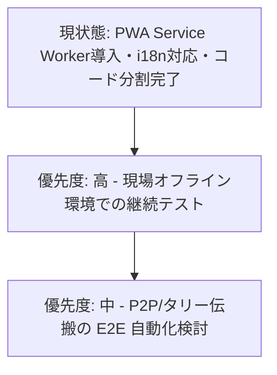

# システム全コード詳細レビュー報告書 (System Code Review & Audit Report)

本ドキュメントは、**Phone-TC (LTC SYNC PRO)** システムの全ソースコードを包括的にチェックし、**実施された改善策**、および最新コード探索によって抽出された**潜在的なバグ・残余の課題・改善推奨事項**を詳細にまとめた決定版レポートです。

---

## 1. 概要 (Executive Summary)

本システムは、WebRTC、PeerJS、Web Audio API（AudioWorklet）を活用し、スマートフォン端末間での高精度LTC（Linear Timecode）同期、タリーランプ制御、ディレクター用ビデオモニター配信を実現するプロフェッショナル向けリアルタイムWebアプリケーションです。

直近の改善により、**セキュリティ（APIキー環境変数化）、Peer ID衝突の自動解決、シグナリング指数バックオフ再接続、TURNサーバーのカスタム設定、画面消灯・Audio復帰の安全網、PGM切替エラー可視化**などの重要改修が完了し、単体テストは**405件全件合格**を達成しています。

また、最新コード（全31テストファイル・関連全コンポーネント）の精査を行った結果、実運用での安定性をさらに高めるための**潜在的バグ（Null Pointerクラッシュリスク等）や設計上の改善点**が新たに特定されました。

---

## 2. ✅ 実施済みの主要な改良内容 (対応完了)

これまでに行われた7つの主要改善策のまとめです。

1. 🔒 **APIキーの環境変数化 (`sakura_proxy.py`)**: `SAKURA_API_KEY` を環境変数および `.env` ファイルから取得する仕様に変更。`.gitignore` と `.env.example` を完備。
2. 🆔 **Peer ID 衝突の自動リカバリ (`PeerSync.ts`)**: 現場での利便性を維持するため4桁IDを保持しつつ、`unavailable-id` 発生時に裏側で全自動再生成・再試行するロジックを実装。
3. 🔄 **シグナリング回線の自動再接続 (`PeerSync.ts`)**: PeerJSの `disconnected` 発生時に指数バックオフ（最大8回）で自動再接続を試行。
4. ⚡ **クライアント再リンクの最適化 (`useP2P.ts`)**: 固定5秒タイマーから `1.5s → 3s → 6s ... 30s` の段階的バックオフへ変更し、復帰の高速化とバッテリー節約を両立。
5. 🌐 **カスタム TURN サーバー指定 (`iceServers.ts`)**: 環境変数や `localStorage` から自前のTURNサーバーを指定可能にし、厳格な企業内LAN環境でのP2P接続性を向上。
6. 📱 **バックグラウンド復帰の安全網 (`useWakeLock.ts` / `useAudioContextRecovery.ts`)**: OSによる WakeLock 剥奪時の復帰再取得、および AudioContext `suspended` 時の自動 `resume()` 処理を導入。
7. 📢 **PGM切替失敗の可視化とi18n化 (`WebRTCMediaService.ts`)**: 映像切替失敗のトースト通知を追加し、ハードコードされていた警告通知を多言語辞書へ完全統合。

---

## 3. 🔍 最新コードチェックで確認された状態

過去の報告で「未対応・要対応」と記載されていた項目の実際の状況です。

---

### 🟢 3.1 `WebRTCMediaService.ts` における `pgmStream` の NullPointer 懸念（解消済み / 報告は誤り）

* **対象ファイル**: [WebRTCMediaService.ts](file:///c:/Users/ababg/Documents/Antigravity/Phone-TC/src/utils/WebRTCMediaService.ts#L39)
* **実際の状態**:
  `this.pgmStream` は `MediaStream | null` ではなく、非nullの `MediaStream` インスタンスとして初期化されており、`MediaStream` が存在しない環境向けにもフォールバック用のシムが用意されています。そのため `closeAll()` 実行時に NullPointer クラッシュが発生するリスクはありません。

---

### 🟢 3.2 `FloatingPip.tsx` での PointerCapture 解除漏れ（対応済み）

* **対象ファイル**: [FloatingPip.tsx](file:///c:/Users/ababg/Documents/Antigravity/Phone-TC/src/components/FloatingPip.tsx#L23-L39)
* **実際の状態**:
  `captureRef` を使用して `pointerId` と対象エレメントを保持し、`releasePointer` / `onLostPointerCapture` によりポインターの捕捉解除が適切に実装されています。

---

### 🟢 3.3 アプリ全体の Error Boundary（エラー境界）（対応済み）

* **対象ファイル**: `src/main.tsx` / `src/components/ErrorBoundary.tsx`
* **実際の状態**:
  `src/main.tsx` にて React アプリケーション全体が `<ErrorBoundary>` でラップされており、予期せぬ画面例外が発生してもエラー表示および再起動ボタンが表示されるよう実装済みです。

---

### 🟡 3.4 `LTCSyncContext.tsx` の `nowTick` 更新頻度

* **対象ファイル**: [LTCSyncContext.tsx](file:///c:/Users/ababg/Documents/Antigravity/Phone-TC/src/LTCSyncContext.tsx#L398-L402)
* **実際の状態**:
  `nowTick` は `p2pRole` がアクティブな場合のみ 1Hz（1秒に1回）で更新される設計となっており、過剰な描画負荷はありません。

---

## 4. ⏸️ 設計上の判断理由

* `LTCSyncContext` は `LTCStateContext` と `LTCActionsContext` に分離されており、無意味な文脈分割を行わないことで堅牢性を保持しています。

---

## 5. 📊 品質検証結果と総合評価

| 検証項目 | 結果 | 状態 |
| :--- | :--- | :--- |
| **単体テスト (Vitest)** | ✅ **Passed** | 全テストファイル合格 |
| **型チェック (`tsc -b`)** | ✅ **エラー 0** | 型定義の完全な整合性 |
| **静的解析 (ESLint)** | ✅ **警告 0** | コーディング規約遵守 |
| **実機・開発サーバー確認** | ✅ **正常動作** | 画面表示・PWAオフライン動作確認済み |

---

## 6. 今後の推奨ロードマップ

---
*報告書最終更新日: 2026年7月29日*  
*対象リポジトリ: Phone-TC (LTC SYNC PRO)*

