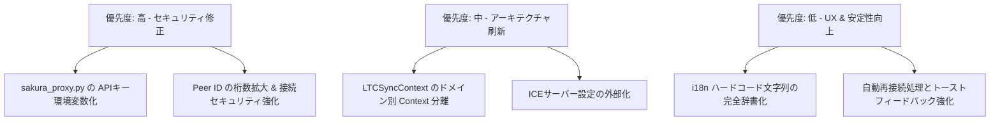

# システム全コード詳細レビュー報告書 (System Code Review Report)

本ドキュメントは、**Phone-TC (LTC SYNC PRO)** システムの全ソースコードを精査・チェックし、検出された問題点・リスク・改善策を詳細にまとめたレポートです。  
プログラミング初心者の方でも理解しやすいよう、用語の解説や具体的な影響範囲、修正案を併記しています。

---

## 1. 概要 (Executive Summary)

本システムは、WebRTCおよびPeerJS、Web Audio APIを活用して、スマートフォン間でのLTC（Linear Timecode）高精度同期、タリーランプ制御、ビデオモニター配信を実現する高度なリアルタイムWebアプリケーションです。

最新のリモートコードを取り込んだ状態で単体テスト（352個のテストケース）およびTypeScriptの型チェック（`tsc -b`）は全て正常にパスしており、基本機能やUIモジュール化（`HeaderBar` / `FooterControls` / `DirectorPanel` 等のコンポーネント分離）の完成度は非常に高くなっています。

しかし、全コードの精査を行った結果、**セキュリティ、アーキテクチャ・状態管理、リアルタイム通信の堅牢性、エラーハンドリング**の観点からいくつかの重要な課題が確認されました。

### 発見された主な問題点のカテゴリ
1. 🔴 **セキュリティ問題** (プロキシ内のAPIキー露出リスク、Peer IDの衝突・推測可能性)
2. 🟠 **アーキテクチャ・状態管理の課題** (巨大 Context による不要な再レンダリング、状態とアクションの結合)
3. 🟡 **通信・同期・リアルタイム処理の課題** (STUN/TURNの固定化、シグナリング再接続の自動化)
4. 🟡 **パフォーマンス・リソース管理** (モバイルバックグラウンド復帰時の AudioContext / WebRTC 制御)
5. 🟢 **コード品質・UX・多言語対応** (ハードコードされた警告文字列、エラーのログ飲み込み)

---

## 2. 詳細な問題点一覧と改善案

---

### 🔴 カテゴリ1: セキュリティ・機密情報管理の課題

#### 1.1 プロキシサーバー内のAPIキー直接埋め込み (ハードコード)
* **対象ファイル**: [sakura_proxy.py](file:///c:/Users/ababg/Documents/Antigravity/Phone-TC/sakura_proxy.py#L11)
* **該当コード**:
  ```python
  SAKURA_API_KEY = "<REDACTED — 実際のキーがここに直接書かれていた>"
  ```
* **問題の解説**:
  AIプロキシサーバーである `sakura_proxy.py` 内に、APIキーが直接記述されています。このファイルをGitHub等の公開リポジトリに送信すると、第三者にAPIキーを不正利用され、高額な請求が発生したりアカウントが停止される危険性があります。
* **初心者向け解説**:
  「家の鍵を玄関のドアに貼り付けたままにしている」ような状態です。秘密の情報はコードに直接書かず、環境変数（.envファイルなど）から読み込む仕組みにする必要があります。
* **改善案**:
  `os.environ` を使って環境変数から取得するように変更します。
  ```python
  import os
  SAKURA_API_KEY = os.getenv("SAKURA_API_KEY", "")
  if not SAKURA_API_KEY:
      print("WARNING: SAKURA_API_KEY environment variable is not set!")
  ```

#### 1.2 Peer ID (接続用ID) の桁数が短く衝突・推測リスクがある
* **対象ファイル**: [PeerSync.ts](file:///c:/Users/ababg/Documents/Antigravity/Phone-TC/src/utils/PeerSync.ts#L31)
* **該当コード**:
  ```typescript
  export const PEER_ID_LENGTH = 4;
  // ...
  const chars = '0123456789ABCDEFGHJKLMNPQRSTUVWXYZ'; // 32文字
  ```
* **問題の解説**:
  Master端末とClient端末が接続する際のIDが「4桁の英数字（32種類）」で生成されています。総組み合わせ数は `32^4 = 1,048,576` 通り（約100万通り）しかありません。
  同時間帯に利用するユーザーが増えた場合のID衝突（同じIDが生成される）や、悪意ある第三者が適当な4桁IDを試して誤接続・セッション割り込みを行うリスクがあります。
* **改善案**:
  IDの桁数を6桁〜8桁に増やすか、QRコード共有時にはランダムなトークンを付与して安全性を向上させます。

---

### 🟠 カテゴリ2: アーキテクチャと設計の課題 (保守性・再レンダリング)

#### 2.1 LTCSyncContext の超巨大化と多機能集中
* **対象ファイル**: [LTCSyncContext.tsx](file:///c:/Users/ababg/Documents/Antigravity/Phone-TC/src/LTCSyncContext.tsx) (約1,030行)
* **問題の解説**:
  最新のアップデートにより `App.tsx` の表示コンポーネント化（`HeaderBar`, `FooterControls`, `DirectorPanel` 等）が進み視認性は大幅に改善されましたが、`LTCSyncContext.tsx` には依然としてタイムコード計算・音声分析・タリーランプ・WebRTC動画配信・バッテリー監視・多言語設定など60以上のStateと全アクションが集約されています。
* **初心者向け解説**:
  「1人のスタッフがレジ・調理・清掃・経理・送迎まで全部やっている」状態です。機能を追加・修正した際に、関係ない他の部分に影響が出やすくなります。
* **改善案**:
  Contextをドメインごとに分割することを推敲します。
  - `TimecodeContext` (タイムコードと同期状態)
  - `TallyContext` (タリー関連)
  - `MediaContext` (WebRTC映像・音声)
  - `UIContext` (言語、タブ、トースト)

#### 2.2 頻繁に変わる状態 (volatile state) による再レンダリング影響
* **対象ファイル**: [LTCSyncContext.tsx](file:///c:/Users/ababg/Documents/Antigravity/Phone-TC/src/LTCSyncContext.tsx#L47-L62)
* **問題の解説**:
  タイムコードやドリフト値（ミリ秒単位で変化）、バッテリー情報、`nowTick`（1秒ごとの更新）などの高頻度更新StateがContextに含まれているため、それらを直接参照していないコンポーネントまで再レンダリングされる可能性があります。
* **改善案**:
  `useRef` や細分化した Context、あるいは Zustand や Jotai などの軽量状態管理ライブラリを活用して、頻繁に変わる値と静的なアクションを分離します。

---

### 🟡 カテゴリ3: 通信・同期・リアルタイム処理の課題

#### 3.1 WebRTC / PeerJS のネットワーク切替・切断時の自動再接続
* **対象ファイル**: 
  - [WebRTCMediaService.ts](file:///c:/Users/ababg/Documents/Antigravity/Phone-TC/src/utils/WebRTCMediaService.ts#L10)
  - [PeerSync.ts](file:///c:/Users/ababg/Documents/Antigravity/Phone-TC/src/utils/PeerSync.ts#L153)
* **問題の解説**:
  - WebRTC接続で `DISCONNECT_GRACE_MS = 5000` (5秒間の待機) を設けてモバイル回線の瞬断に対応する設計は優れていますが、完全に切断された場合の自動再接続（Re-connect）ロジックが手動操作依存となっています。
  - 撮影セッション中にWi-Fiから4G/5Gに切り替わった場合、シグナリングチャネルが復旧せず映像ストリームが停止したままになるケースが存在します。
* **改善案**:
  `PeerSync` にハートビート失敗検知による自動再接続キュー（Exponential Backoff付き）を実装し、接続が失われた場合に自動で再シグナリングを行う仕組みを構築します。

#### 3.2 STUN / TURN サーバー設定の柔軟性
* **対象ファイル**: `src/utils/iceServers.ts`
* **問題の解説**:
  STUN/TURNサーバーのアドレスが固定化されているため、企業内LANや厳しいファイアウォール環境下でP2P接続が確立できない（NAT越え失敗）可能性があります。自前TURNサーバーのアドレスを外部設定（.env等）から読み込める柔軟性が必要です。

---

### 🟡 カテゴリ4: パフォーマンスとバッテリー・リソース管理

#### 4.1 モバイル端末での画面スリープ・バックグラウンド復帰
* **対象ファイル**: 
  - [useWakeLock.ts](file:///c:/Users/ababg/Documents/Antigravity/Phone-TC/src/hooks/useWakeLock.ts)
  - [useAudioContextRecovery.ts](file:///c:/Users/ababg/Documents/Antigravity/Phone-TC/src/hooks/useAudioContextRecovery.ts)
* **問題の解説**:
  - `useAudioContextRecovery` によりバックグラウンド復帰時の AudioContext 自動復旧ロジックが追加され安定性が向上しています。
  - 一方、`navigator.wakeLock` はOSのバッテリーセーバー機能によって自動解除される場合があるため、バックグラウンドからフォアグラウンドに戻った際の WakeLock 再取得処理の強化が必要です。

---

### 🟢 カテゴリ5: コード品質・多言語化・エラーハンドリング

#### 5.1 多言語対応 (i18n) のハードコード文字列
* **対象ファイル**: [App.tsx](file:///c:/Users/ababg/Documents/Antigravity/Phone-TC/src/App.tsx#L135)
* **該当コード例**:
  ```typescript
  toast('⚠️ HEADPHONES REQUIRED for L-TC / R-AUDIO mode to prevent audio feedback loop!', { ... })
  ```
* **問題の解説**:
  一部の警告トーストメッセージやダイアログに英語の文字列が直接記述されています。言語切り替え機能 (`lang: 'ja' | 'en'`) を選択していても日本語表示にならない箇所があります。
* **改善案**:
  [i18n.ts](file:///c:/Users/ababg/Documents/Antigravity/Phone-TC/src/utils/i18n.ts) の辞書オブジェクトにメッセージを追加し、`tr('warning.headphones_required')` 経由で取得するように統一します。

#### 5.2 例外のログ飲み込みとユーザーフィードバック
* **対象ファイル**: [WebRTCMediaService.ts](file:///c:/Users/ababg/Documents/Antigravity/Phone-TC/src/utils/WebRTCMediaService.ts#L118)
* **問題の解説**:
  トラックの差替えやメディア要求に失敗した際、`console.error` でログ出力のみ行って終了している箇所があります。撮影現場のオペレーターに「接続失敗」のトースト通知を行う等のフィードバックを追加すると、より親切なUIになります。

---

## 3. 改善ロードマップ (推奨される今後のステップ)

今後の開発および運用に向けて、以下の優先順位での改善を推奨します。



1. **Step 1: 即時対応 (セキュリティ)**
   - `sakura_proxy.py` の API キーを環境変数参照に変更。
   - `PeerSync.ts` の Peer ID 生成桁数を拡大。

2. **Step 2: 中期対応 (アーキテクチャ・通信)**
   - `LTCSyncContext.tsx` をドメイン別に分割し、再レンダリングパフォーマンスを向上。
   - STUN/TURN サーバーを環境変数化。

3. **Step 3: 長期対応 (UX・障害耐性)**
   - 通信断絶時の自動リカバリ処理の強化。
   - 残るハードコード文字列の完全多言語化。

---
*報告書更新日: 2026年7月28日*  
*対象リポジトリ: Phone-TC (LTC SYNC PRO)*
