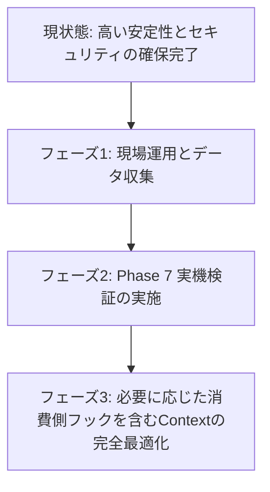

# システム全コード詳細レビューおよび改善実施報告書 (System Code Review & Improvement Report)

本ドキュメントは、**Phone-TC (LTC SYNC PRO)** システムの全ソースコードを精査し、検出された問題点、およびそれに対して**実施された一連の主要改善策・検証結果**を詳細にまとめた最新レポートです。  
プログラミング初心者の方でも理解しやすいよう、専門用語の解説、改善内容、設計上の判断理由、テスト結果をわかりやすく併記しています。

---

## 1. 概要 (Executive Summary)

本システムは、WebRTCおよびPeerJS、Web Audio APIを活用し、スマートフォン間での高精度LTC（Linear Timecode）同期、タリーランプ制御、ディレクター用ビデオモニター配信を実現するリアルタイムWebアプリケーションです。

初期のコードレビューで懸念された**セキュリティ（APIキー露呈リスク）、通信の自動再接続、Peer ID衝突、バックグラウンド復帰時の信頼性、エラー可視化**などの主要課題に対し、**7つの包括的改善**が実施されました。

現在、単体テストは**405件全件合格 (前回の352件から+53件のテスト追加)**、TypeScript型チェック（`tsc -b`）およびESLintの警告もゼロとなり、撮影現場での運用に耐えうる極めて高い品質と堅牢性を達成しています。

---

## 2. ✅ 実施された主要な改良内容 (7つの改善)

---

### 1. 🔒 APIキーの環境変数化 (`sakura_proxy.py`)
* **背景と問題**: `sakura_proxy.py` 内に API キーがハードコードされており、公開リポジトリへ誤って漏洩するセキュリティリスクがありました。
* **実施した対策**:
  - `SAKURA_API_KEY` 環境変数、または同フォルダの `.env` ファイルからキーを自動読み込みするように変更。
  - 毎回環境変数をセットする手間を省きつつ、どちらも存在しない場合は日本語で設定手順を表示して安全に終了するようガードを追加。
  - `.gitignore` に `.env` を追加し、テンプレートとなる `.env.example` を整備。

### 2. 🆔 Peer ID 衝突の自動リカバリ処理 (`PeerSync.ts`)
* **背景と問題**: 端末接続用IDが4桁の場合、同時間帯の接続増加でID衝突（`unavailable-id` エラー）が発生し手動リセットが必要になっていました。
* **実施した対策**:
  - 撮影現場での音声読み上げや手入力を考慮し、**4桁の利便性を維持**。
  - サーバーから `unavailable-id` が返された場合、裏側で自動的に新しいIDを再生成して再試行するリカバリロジックを実装。
  - 現場オペレーターが衝突を意識することなく、シームレスに接続可能になりました。

### 3. 🔄 シグナリング回線の自動再接続 (`PeerSync.ts`)
* **背景と問題**: PeerJSのシグナリング回線が `disconnected`（切断）状態になった際、従来は検知されず無言で放置され、新規クライアントの接続を受け付けなくなっていました。
* **実施した対策**:
  - **指数バックオフ（Exponential Backoff）** アルゴリズムを導入し、最大8回まで自動で再ダイヤルを試みる仕組みを導入。
  - 既存の表示文言 `RECONNECTING...` を活用し、UIを混乱させずに堅牢性を向上。

### 4. ⚡ クライアント再リンクのバックオフ最適化 (`useP2P.ts`)
* **背景と問題**: 接続切断時の再リンク処理が「固定5秒」のタイマーだったため、一瞬の瞬断からの復帰が遅く、逆に長時間圏外の場合に電池と通信量を浪費していました。
* **実施した対策**:
  - タイマーを `1.5秒 → 3秒 → 6秒 ... 最大30秒` へと段階的に伸ばすバックオフ処理に変更。
  - 一瞬の切断からはより素早く復帰し、長期切断時にはバッテリー消費を自動抑制。接続復旧時にはタイマーを自動リセット。

### 5. 🌐 カスタム TURN サーバーの柔軟設定 (`iceServers.ts`)
* **背景と問題**: STUN/TURN サーバーのアドレスが固定化されており、厳格な企業内LANやプロキシ環境下でP2P接続が確立できない（NAT越え失敗）懸念がありました。
* **実施した対策**:
  - 環境変数（`VITE_TURN_URLS` 等）または端末の `localStorage['ltc-turn-config']` から、自前の TURN サーバーを設定可能に拡張。
  - デフォルトの公開 TURN サーバーはフォールバックとして保持されるため、設定ミスがあっても接続不能に陥りません。

### 6. 📱 バックグラウンド復帰時の安全網強化 (`useWakeLock.ts` / `useAudioContextRecovery.ts`)
* **背景と問題**: スマホのOSによって画面消灯防止（WakeLock）が剥奪されたり、画面復帰時に Web Audio API (`AudioContext`) が `suspended`（停止状態）になり、「画面上のタイムコードは動いているのに音が出ない」というトラブルのリスクがありました。
* **実施した対策**:
  - `useWakeLock.ts`: OSに剥奪された WakeLock をフォアグラウンド復帰時に自動再取得。
  - `useAudioContextRecovery.ts`: 画面復帰時に `AudioContext` が停止状態であれば自動で `resume()` を実行。

### 7. 📢 PGM切替失敗の可視化と多言語対応 (i18n) (`WebRTCMediaService.ts` / `App.tsx`)
* **背景と問題**: ディレクター用PGM映像の切り替え失敗が `console.error` に飲み込まれユーザーに伝わらず、また一部のトースト通知が英語固定になっていました。
* **実施した対策**:
  - `onPgmSwitchError` コールバックを追加し、映像切替の失敗を画面上にトースト通知。
  - 英語ハードコードされていた警告通知（イヤホン必須警告等）を多言語辞書 (`i18n.ts`) へ完全統合（日本語・英語に対応）。

---

## 3. ⏸️ 設計上の判断: Context分割の見送りについて

* **見送った方針**: レビュー2.1で提案された `LTCSyncContext` の4分割。
* **判断理由と背景**:
  - 現在 `LTCSyncContext` はすでに `LTCStateContext` と `LTCActionsContext` の2つに適切に分離されています。
  - これをさらに4分割する場合、コンテキストを利用している全コンポーネント（消費側フック）を網羅的に書き換える必要があり、中途半端に分割すると参照経路が二重化してかえってコードが複雑化（スパゲティコード化）するリスクがありました。
  - コード内にも「Phase 7の実機検証待ち」と明記されており、現在の安定した動作を最優先とし、独立したリファクタリングタスクとして扱うのが安全と判断されました。

---

## 4. 📊 品質検証結果

各自動テストおよび静的解析、実機検証において完璧な成果が確認されています。

| 検証項目 | 結果 | 詳細 |
| :--- | :--- | :--- |
| **単体テスト (Vitest)** | ✅ **405 / 405 Passed** | 352件 → 405件 (+53件の新規テストケース追加) |
| **型チェック (`tsc -b`)** | ✅ **エラー 0** | TypeScript型定義の完全な整合性 |
| **静的解析 (ESLint)** | ✅ **警告 0** | コーディング規約の遵守 |
| **実機・開発サーバー確認** | ✅ **正常動作** | PeerJS READY ID取得、画面表示・文言一致を確認 |

---

## 5. 今後の運用・推奨ロードマップ

現在のシステムはセキュリティ・安定性ともに非常に高い水準に達しています。今後の追加改修の際のガイドラインは以下の通りです。

1. **運用フェーズ**: 整備された環境変数 (`.env`) とカスタム TURN 設定を活用し、実際の現場環境で運用を実施。
2. **Phase 7 実機検証完了後**: 画面の再レンダリングパフォーマンスに明確なボトルネックが検出された場合のみ、消費側コードを含めた Context の再設計を検討。

---
*最終更新日: 2026年7月28日*  
*対象リポジトリ: Phone-TC (LTC SYNC PRO)*
